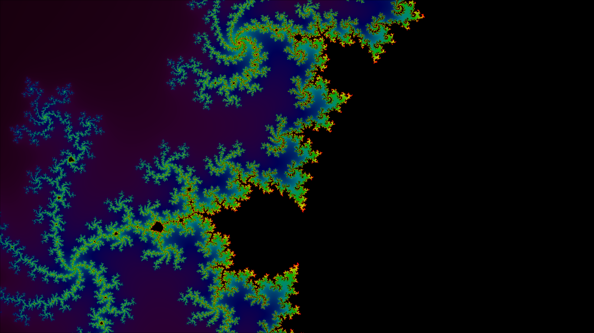

# Paya 

A vulkan abstraction meant to make creating graphics projects easier. Abstracts over resource creation and follows a bindless model which removes the need for descriptor set management.

This project is currently in development alongside my pet voxel project [voxei](https://github.com/paratym/voxei.git).

This visualization is rendered from `examples/mandelbrot`

